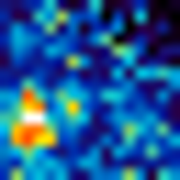
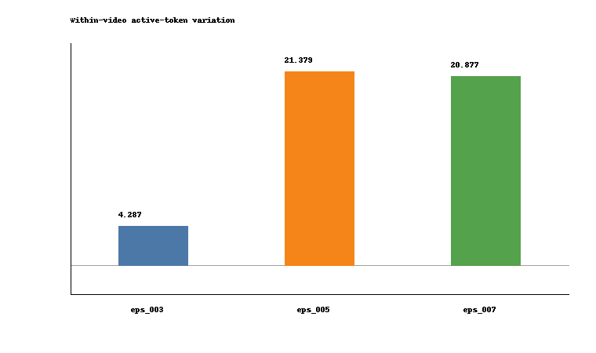

# KARL on Videos

This repository is an exploratory extension of **KARL** from images to short videos. The central question is:

> What does KARL's adaptive image tokenizer preserve, discard, and organize when it is applied frame-by-frame to video QA examples?

The project uses short videos from the **Perception Test** train MCQ split and treats KARL as an image tokenizer applied to sampled video frames. The goal is to build focused analysis probes around token usage, compression, reconstruction, and latent attention behavior.

## Analysis Directions

The repository is organized as four linked analysis notes. I am packaging them one by one so each can be read independently.

| direction | status | note |
|---|---|---|
| 1. Object-like and temporally persistent attention maps | packaged | [analysis README](docs/experiment_1_object_read_attention.md) |
| 2. KARL reconstructions and downstream VLM behavior | packaged | [analysis README](docs/experiment_2_qwen_karl_tradeoff.md) |
| 3. Higher compression keeps more distinct tokens | packaged | [analysis README](docs/experiment_3_latent_distinctiveness.md) |
| 4. Epsilon vs token utilization over video frames | packaged | [analysis README](docs/experiment_4_temporal_token_usage.md) |

## Direction 1 Snapshot

For selected active latent indices, Direction 1 visualizes the attention map from the latent query to the original `16x16` image/VQGAN grid:

```text
attention_map(k) = mean_heads Attention(q_latent[k], K_input_grid)
```

On cup-moving clips, several selected latent token indices produce compact attention maps over object-like regions such as cups, hands, and table surfaces. More interestingly, when the same latent token index is tracked across 8 uniformly sampled frames from the same video, its attention map often remains spatially concentrated instead of becoming diffuse. This suggests that some active KARL latent indices repeatedly attend to stable scene regions across time.
Preview:

| source frame | latent 36 attention map | latent 132 attention map |
|---|---|---|
|  |  |  |
| original `video_76` frame | cup-like region | hand-like region |

See the detailed note: [Direction 1: KARL Attention Maps](docs/experiment_1_object_read_attention.md).

## Direction 2 Snapshot

The currently packaged direction asks whether Qwen2.5-VL-7B-Instruct can still answer Perception Test MCQs when original frames are replaced by KARL reconstructions at different epsilon thresholds.

Combined analysis set:

```text
664 MCQs
324 unique videos
8 uniformly sampled frames per question/video
```

Global result:

| condition | Qwen accuracy | mean active KARL tokens |
|---|---:|---:|
| original frames | 0.6280 | 256.00 |
| KARL eps=0.03 | 0.5858 | 248.40 |
| KARL eps=0.05 | 0.5512 | 191.16 |
| KARL eps=0.07 | 0.5301 | 111.10 |

The main pattern is task-dependent compression sensitivity: recognition/detail-heavy tags degrade most, while motion and occlusion-style tags are more stable in this run. In the same-video subset, among clips containing both tags at `eps=0.07`, motion questions were more often correct than action-counting questions on the same videos.

See the detailed note: [Direction 2: KARL Reconstructions and Downstream VLM Behavior](docs/experiment_2_qwen_karl_tradeoff.md).

## Direction 3 Snapshot

Direction 3 looks inside the active KARL token set itself. For each frame, it compares pairs of active latent attention maps:

```text
attention_map(k) = mean_heads Attention(q_latent[k], K_input_grid)
```

The question is whether stronger compression leaves behind a collapsed set of similar tokens or a smaller set of more distinct attention patterns.

| epsilon | mean active tokens | attention correlation | top-cell IoU | attention distinctness |
|---|---:|---:|---:|---:|
| 0.03 | 251.25 | 0.4604 | 0.2900 | 0.5396 |
| 0.05 | 198.89 | 0.2052 | 0.1055 | 0.7948 |
| 0.07 | 115.57 | 0.1358 | 0.0737 | 0.8642 |

The pattern is sharp: as epsilon increases, KARL keeps fewer tokens, but those tokens have less-overlapping attention maps. This suggests that compression removes redundant attention patterns first and preserves a smaller, more spatially distinct active set.

Example visual column: `video_76`, frame `f0`, latent `36`.

| epsilon | source frame | latent 36 |
|---|---|---|
| 0.03 |  |  |
| 0.05 |  |  |
| 0.07 |  |  |

See the detailed note: [Direction 3: Compression Keeps More Distinct Latent Attention Maps](docs/experiment_3_latent_distinctiveness.md).

## Direction 4 Snapshot

Direction 4 tracks KARL's active token count across 8 uniformly sampled frames from the same video.

| epsilon | mean active-token std | mean active-token range | zero-range videos | corr(active tokens, frame diff) |
|---|---:|---:|---:|---:|
| 0.03 | 4.29 | 10.98 | 43 | 0.025 |
| 0.05 | 21.38 | 59.43 | 11 | 0.049 |
| 0.07 | 20.88 | 57.37 | 6 | -0.053 |

The pattern is that temporal variation is almost flat near the full-token setting, then becomes much larger once compression is stronger. A simple RGB frame-difference signal does not explain this variation well on average.



See the detailed note: [Direction 4: Temporal Token Usage](docs/experiment_4_temporal_token_usage.md).

## Dataset Construction

No new question annotations are introduced. The questions, answer options, answer IDs, tags, reasoning labels, and videos come from the official Perception Test train MCQ annotations.

The curation steps are:

1. Parse official train MCQ annotations.
2. Verify that referenced train videos and 3-option MCQs are available locally.
3. Map official fine-grained tags into five broader visual task families.
4. Build a balanced task subset and a same-video multi-question control subset.
5. Combine both subsets and deduplicate exact overlaps by `row_uid = split:video_id:question_id`.

See [docs/dataset_construction.md](docs/dataset_construction.md) for the exact construction.

## Included Artifacts

This repository includes compact scripts, aggregate reports, tables, and figures. It intentionally excludes large data artifacts.

Included packaged artifacts:

- [Direction 1 detailed README](docs/experiment_1_object_read_attention.md)
- [Selected Direction 1 attention heatmaps](results/direction1_object_read_attention_v1/attention_heatmaps)
- [Direction 2 detailed README](docs/experiment_2_qwen_karl_tradeoff.md)
- [Major-tag accuracy table](results/combined_qwen_karl_v1/tables/combined_major_tag_accuracy.csv)
- [Direction 3 detailed README](docs/experiment_3_latent_distinctiveness.md)
- [Direction 3 latent diversity summary](results/latent_distinctiveness_v1/tables/latent_epsilon_diversity_summary.csv)
- [Direction 3 visual attention examples](results/latent_distinctiveness_v1/attention_examples)
- [Direction 4 detailed README](docs/experiment_4_temporal_token_usage.md)
- [Direction 4 temporal token usage summary](results/temporal_token_usage_v1/tables/temporal_token_usage_summary.csv)

The Direction 2 README embeds its main figures directly. Direction 3 uses compact visual attention examples instead of separate chart artifacts.

Excluded:

- raw Perception Test videos
- raw official annotation JSONs
- model checkpoints
- KARL reconstructions
- attention `.npz` files
- full Qwen prediction JSONLs

## Scripts

Scripts are under [scripts/](scripts):

```text
build_mcq_manifest.py
curate_task_data.py
render_direction1_read_attention_assets.py
run_qwen_perception_calibration.py
run_karl_reconstruction_mdl.py
run_qwen_on_karl_reconstructions.py
analyze_combined_qwen_karl_tradeoff.py
analyze_karl_latent_diversity.py
render_direction3_attention_examples.py
analyze_karl_temporal_token_usage.py
```

They assume local access to the Perception Test train MCQ data, a KARL VQGAN checkpoint, and a Qwen2.5-VL environment.
