# Direction 1: KARL Read Attention Maps

This note visualizes where selected active KARL latent indices read from in short video frames.

## Map Definition

KARL reads a frame through an encoder attention block that mixes latent-token queries with the original `16×16` image/VQGAN grid. For an active latent index `k`, I extract the encoder attention from latent query `k` to the image-grid keys:

```text
read_map(k) = mean_heads Attention(q_latent[k], K_input_grid) in R^{16x16}
```

This map shows which input grid locations a latent token attends to while forming its representation.

Settings used here:

- Encoder layer: `7`
- Compression threshold: `eps=0.07`
- Active latent condition: `halt_probability <= 0.75`
- Video sampling: `8` uniformly sampled frames from `video_76`
- Visualization: `16×16` map upsampled to `256×256`
- Color scale: contrast-normalized independently per latent/frame

`latent index` is the identity tracked across frames. Text labels are manual visual notes, not ground truth.

## Video Preview

`video_76`, 8 uniformly sampled frames:

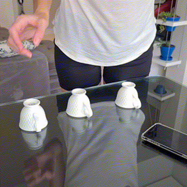

## First-Frame Maps: `video_76`

Each column after the source frame is the attention map for one active latent index from the same frame. A compact bright region means that latent reads most strongly from that part of the `16×16` input grid. This shows signals towards mapping certain latent tokens to distinct objects in the frames.

<table>
  <tr>
    <th>original</th>
    <th>latent 36</th>
    <th>latent 38</th>
    <th>latent 39</th>
    <th>latent 42</th>
    <th>latent 159</th>
    <th>latent 132</th>
    <th>latent 158</th>
  </tr>
  <tr>
    <td></td>
    <td>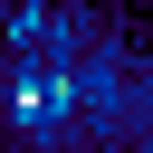</td>
    <td>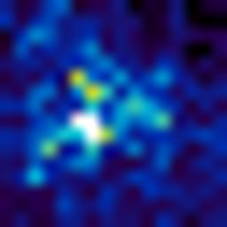</td>
    <td>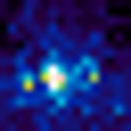</td>
    <td></td>
    <td>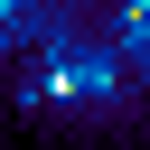</td>
    <td>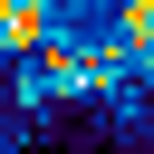</td>
    <td>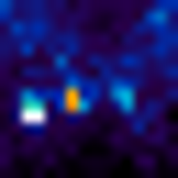</td>
  </tr>
  <tr>
    <td>source frame</td>
    <td>cup</td>
    <td>cup</td>
    <td>cup</td>
    <td>cup</td>
    <td>cup</td>
    <td>hand</td>
    <td>three-cup group</td>
  </tr>
</table>

## First-Frame Maps: `video_1614`

This second clip gives another first-frame check that the read attention maps are not all diffuse: several selected latent indices place most of their mass on visually distinct cup/table regions.

<table>
  <tr>
    <th>original</th>
    <th>latent 0</th>
    <th>latent 3</th>
    <th>latent 4</th>
    <th>latent 17</th>
    <th>latent 20</th>
    <th>latent 25</th>
    <th>latent 35</th>
    <th>latent 53</th>
    <th>latent 103</th>
  </tr>
  <tr>
    <td>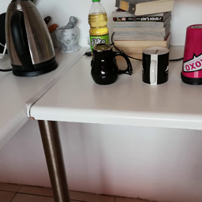</td>
    <td>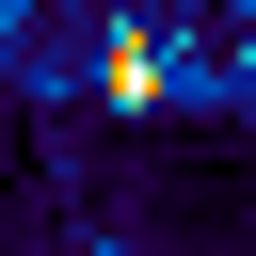</td>
    <td>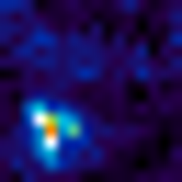</td>
    <td>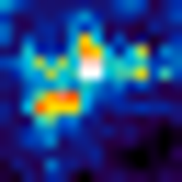</td>
    <td>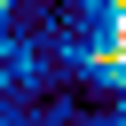</td>
    <td>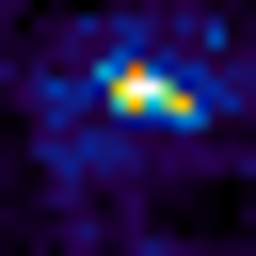</td>
    <td>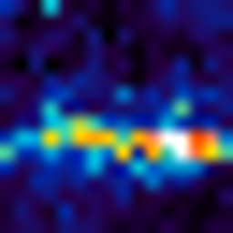</td>
    <td>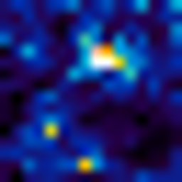</td>
    <td></td>
    <td>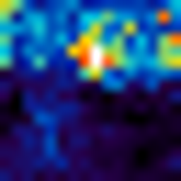</td>
  </tr>
  <tr>
    <td>source frame</td>
    <td>cup</td>
    <td>table leg</td>
    <td>cup</td>
    <td>cup</td>
    <td>cup</td>
    <td>table edge</td>
    <td>cup</td>
    <td>cup</td>
    <td>cup</td>
  </tr>
</table>

## Temporal Concentration In `video_76`

Columns represent time: f0 to f7 are the 8 uniformly sampled frames from the same video. The first row shows the original frame at each timestep. Each lower row follows one fixed KARL latent index across those frames. The key observation is that several latent indices do not diffuse randomly over time: they remain spatially concentrated in similar regions of the scene across frames. This suggests that, at least in these examples, individual active latent indices can exhibit persistent spatial fixation within a video.

<table>
  <tr>
    <th>latent index</th>
    <th>visual note</th>
    <th>f0</th>
    <th>f1</th>
    <th>f2</th>
    <th>f3</th>
    <th>f4</th>
    <th>f5</th>
    <th>f6</th>
    <th>f7</th>
  </tr>
  <tr>
    <td>source</td>
    <td>original color frame</td>
    <td></td>
    <td>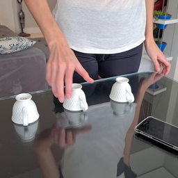</td>
    <td>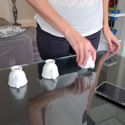</td>
    <td>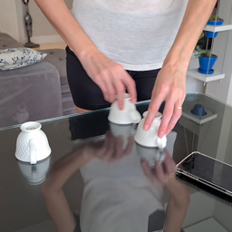</td>
    <td>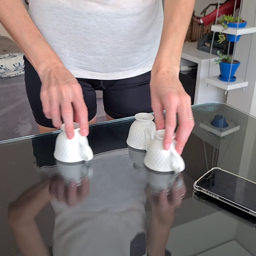</td>
    <td>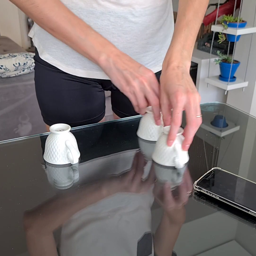</td>
    <td>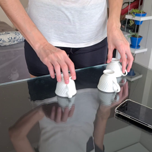</td>
    <td>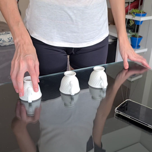</td>
  </tr>
  <tr>
    <td>36</td>
    <td>left-cup spatial area</td>
    <td></td>
    <td>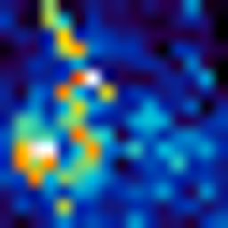</td>
    <td>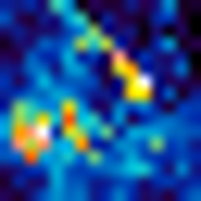</td>
    <td>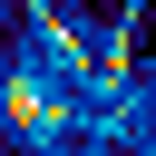</td>
    <td>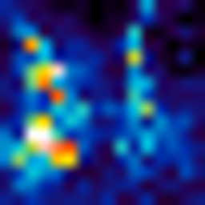</td>
    <td>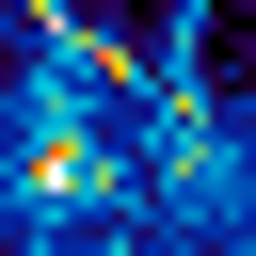</td>
    <td>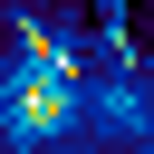</td>
    <td>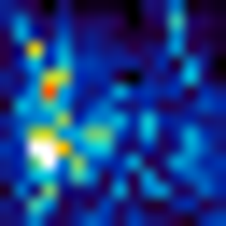</td>
  </tr>
  <tr>
    <td>39</td>
    <td>cup-like spatial area</td>
    <td></td>
    <td>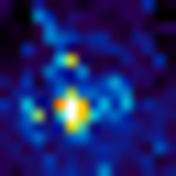</td>
    <td>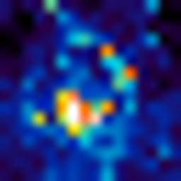</td>
    <td>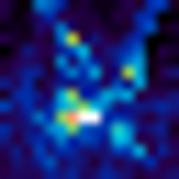</td>
    <td>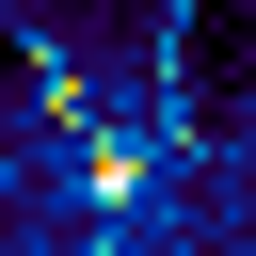</td>
    <td>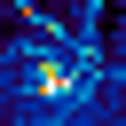</td>
    <td>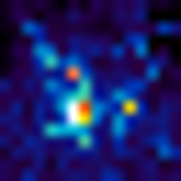</td>
    <td>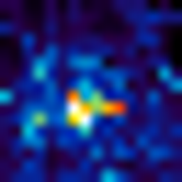</td>
  </tr>
  <tr>
    <td>42</td>
    <td>cup-like spatial area</td>
    <td>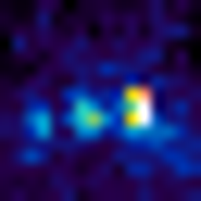</td>
    <td>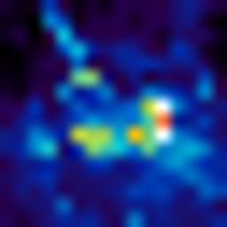</td>
    <td>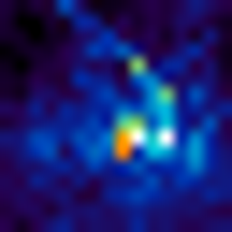</td>
    <td>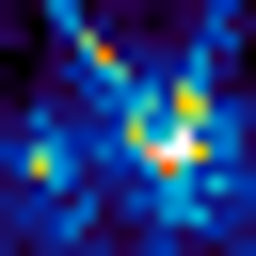</td>
    <td>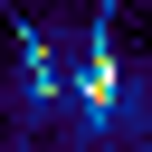</td>
    <td>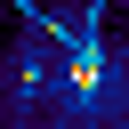</td>
    <td>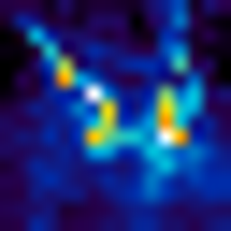</td>
    <td>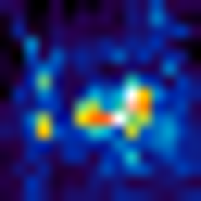</td>
  </tr>
  <tr>
    <td>43</td>
    <td>shirt/t-shirt spatial area</td>
    <td>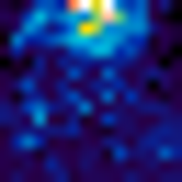</td>
    <td>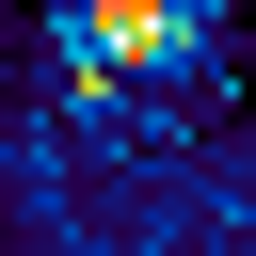</td>
    <td>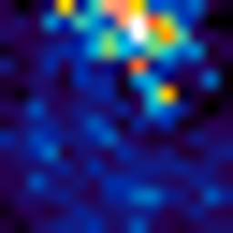</td>
    <td>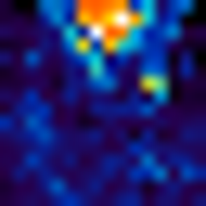</td>
    <td>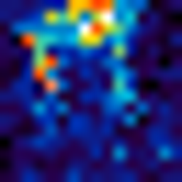</td>
    <td></td>
    <td></td>
    <td></td>
  </tr>
  <tr>
    <td>159</td>
    <td>cup-like spatial area when active</td>
    <td></td>
    <td></td>
    <td></td>
    <td>inactive</td>
    <td></td>
    <td></td>
    <td></td>
    <td></td>
  </tr>
</table>

## Reading Notes

- Bright regions are high relative attention within that latent map.
- Compare each temporal column vertically against the source frame.
- `inactive` means that latent index was not active for that frame.
- These are attention visualizations, not causal attribution or segmentation results.

## Artifacts

- Selected attention heatmaps: [results/direction1_object_read_attention_v1/attention_heatmaps](../results/direction1_object_read_attention_v1/attention_heatmaps)
