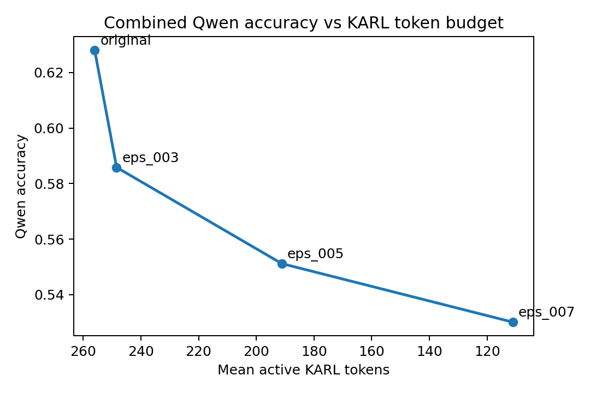
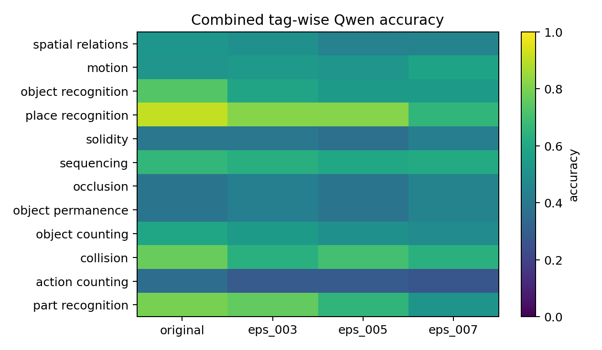

# Direction 1: KARL Reconstructions And Downstream VLM Behavior

## Research Question

If original video frames are replaced by KARL reconstructions, which Perception Test question types remain answerable by Qwen2.5-VL-7B-Instruct and which degrade as KARL uses fewer active tokens?

This direction uses Qwen only as a downstream probe. The main object of study is still KARL: how much task-relevant visual information survives at different reconstruction-quality thresholds.

## Dataset

All questions come from the official **Perception Test train MCQ** annotations. The official data provides the video ID, question, three answer options, answer ID, semantic area, reasoning label, and fine-grained tags.

Two curated subsets are combined:

| subset | rows | videos | purpose |
|---|---:|---:|---|
| main balanced subset | 300 | 285 | broad task/tag coverage |
| same-video control subset | 385 | 60 | multiple questions on the same visual evidence |
| exact overlap | 21 | - | removed during deduplication |
| combined analysis set | 664 | 324 | final Direction 1 set |

The same-video subset is intentionally not a random sample. It is enriched for videos with multiple question types so we can compare different questions over shared frames.

## Evaluation Setup

- VLM: Qwen2.5-VL
- Tokenizer: `karl_small` with VQGAN quantized latents
- Frame sampling: 8 uniformly sampled RGB frames per question/video
- Image size: 256 x 256
- Conditions: original frames, KARL reconstructions at `eps=0.03`, `eps=0.05`, `eps=0.07`
- Task metadata: Perception Test tags plus broader task-family groupings from the curation script

The original-frame Qwen run is the baseline. For each epsilon, sampled frames are passed through KARL, reconstructed, and then used as Qwen's visual input with the same MCQ prompt.

## Global Tradeoff

| condition | rows | Qwen accuracy | accuracy delta | mean active KARL tokens | reconstruction L1 |
|---|---:|---:|---:|---:|---:|
| original frames | 664 | 0.6280 | 0.0000 | 256.00 | 0.00000 |
| KARL eps=0.03 | 664 | 0.5858 | -0.0422 | 248.40 | 0.04296 |
| KARL eps=0.05 | 664 | 0.5512 | -0.0768 | 191.16 | 0.04705 |
| KARL eps=0.07 | 664 | 0.5301 | -0.0979 | 111.10 | 0.05964 |

The headline observation is that stronger compression lowers Qwen accuracy, but the drop is not uniform across question types. At `eps=0.07`, the mean active token count is less than half the original 256-token budget while Qwen retains a substantial fraction of baseline accuracy.

## Tag-Level Behavior

At `eps=0.07`, the most compression-sensitive tags are recognition/detail-heavy:

| tag | n | original | eps=0.07 | delta |
|---|---:|---:|---:|---:|
| part recognition | 29 | 0.7931 | 0.5172 | -0.2759 |
| place recognition | 88 | 0.9091 | 0.6591 | -0.2500 |
| object recognition | 101 | 0.7327 | 0.5446 | -0.1881 |
| object counting | 110 | 0.5909 | 0.4818 | -0.1091 |

Some temporal and occlusion/permanence-style tags are more stable in this run:

| tag | n | original | eps=0.07 | delta |
|---|---:|---:|---:|---:|
| motion | 172 | 0.5233 | 0.5814 | +0.0581 |
| occlusion | 65 | 0.3846 | 0.4462 | +0.0615 |
| object permanence | 65 | 0.3846 | 0.4462 | +0.0615 |
| solidity | 68 | 0.3971 | 0.4265 | +0.0294 |

These trends suggest that KARL compression affects different kinds of visual evidence differently. In this run, temporal and occlusion-style questions were more robust than recognition/detail-heavy questions. While not conclusive, this points to a plausible pattern: KARL reconstructions may preserve enough coarse visual structure for some higher-level tasks, but lose fine-grained details needed for recognition and part-level questions.

## Same-Video Observation

In the same-video subset, among clips containing both tags at `eps=0.07`, motion questions were more often correct than action-counting questions on the same videos.

## Artifacts

The main reader-facing result is this page. The supporting combined summary contains the dataset construction counts, global tradeoff table, full major-tag table, and the negative-delta compression-sensitive tag table.

- [Combined summary](../results/combined_qwen_karl_v1/reports/combined_qwen_karl_tradeoff_summary.md)
- [Major-tag accuracy](../results/combined_qwen_karl_v1/tables/combined_major_tag_accuracy.csv)

Relevant scripts:

- [curate_task_data.py](../scripts/curate_task_data.py)
- [run_qwen_perception_calibration.py](../scripts/run_qwen_perception_calibration.py)
- [run_karl_reconstruction_mdl.py](../scripts/run_karl_reconstruction_mdl.py)
- [run_qwen_on_karl_reconstructions.py](../scripts/run_qwen_on_karl_reconstructions.py)
- [analyze_combined_qwen_karl_tradeoff.py](../scripts/analyze_combined_qwen_karl_tradeoff.py)

## Interpretation

This direction establishes a downstream sanity check for using KARL on video frames. KARL reconstructions are not lossless, and recognition/detail-heavy tasks are the first to suffer. But the degradation is structured rather than uniform: a much smaller active-token set can still preserve enough information for many MCQ decisions.

The follow-up directions move away from Qwen and analyze KARL's internal tokenizer behavior directly.
