# Direction 3: Compression Keeps More Distinct Latent Attention Maps

This probe asks whether stronger KARL compression makes the remaining active latent tokens collapse onto the same image regions, or whether the surviving tokens become less redundant.

## Metric

For each active latent index `k`, I use the encoder attention map from Direction 1:

```text
attention_map(k) = mean_heads Attention(q_latent[k], K_input_grid) in R^{16x16}
```

For each frame and epsilon, active attention maps are normalized and compared pairwise. The analysis samples up to 5,000 active-token pairs per frame.

- Pairwise correlation: higher means two latent tokens attend to similar spatial patterns.
- Top-cell IoU: overlap between each token's top 16 attended grid cells.
- Center distance: distance between the attention centers of two latent tokens.
- Attention distinctness: `1 - pairwise correlation`.

Setup:

```text
60 unique videos
8 uniformly sampled frames per video
480 frame rows per epsilon
eps = 0.03, 0.05, 0.07
```

## Result

| epsilon | mean active tokens | attention correlation | top-cell IoU | center distance | attention distinctness |
|---|---:|---:|---:|---:|---:|
| 0.03 | 251.25 | 0.4604 | 0.2900 | 1.477 | 0.5396 |
| 0.05 | 198.89 | 0.2052 | 0.1055 | 2.033 | 0.7948 |
| 0.07 | 115.57 | 0.1358 | 0.0737 | 2.414 | 0.8642 |

As epsilon increases, KARL keeps fewer active tokens. But the surviving attention maps also become less similar: pairwise correlation drops, top-cell overlap drops, and attention centers move farther apart. The strongest signal is not just that KARL uses fewer tokens, but that the remaining tokens appear less redundant in where they attend.

## Visual Check

The table below is a qualitative check for the same idea. It fixes the visual input to the first sampled frame of `video_76`, then compares several active latent-token attention maps at `eps=0.03`, `eps=0.05`, and `eps=0.07`.

Rows are epsilon settings. Columns are latent token indices. All listed latent indices are active in this frame for all three epsilon settings. The point is to visually check whether the surviving token set becomes less redundant: at stronger compression, fewer tokens remain active, and the selected surviving maps show more separated attention patterns. The aggregate pairwise metrics above make the dataset-level claim; this table gives a concrete first-frame example.

<table>
  <tr>
    <th>epsilon</th>
    <th>source</th>
    <th>latent 36</th>
    <th>latent 38</th>
    <th>latent 39</th>
    <th>latent 42</th>
    <th>latent 132</th>
    <th>latent 158</th>
    <th>latent 159</th>
  </tr>
  <tr>
    <td>0.03</td>
    <td></td>
    <td></td>
    <td>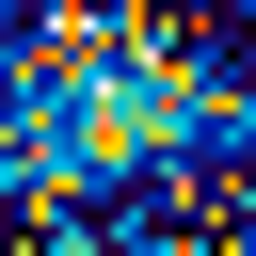</td>
    <td>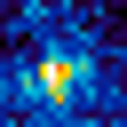</td>
    <td>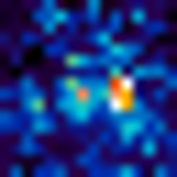</td>
    <td>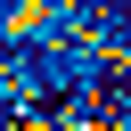</td>
    <td>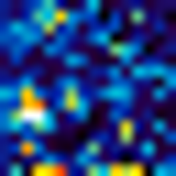</td>
    <td>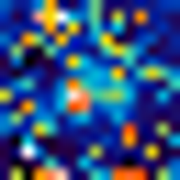</td>
  </tr>
  <tr>
    <td>0.05</td>
    <td></td>
    <td></td>
    <td>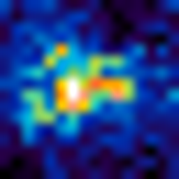</td>
    <td>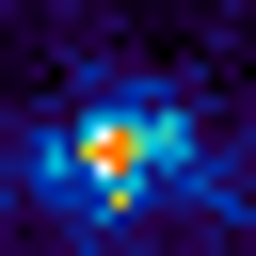</td>
    <td>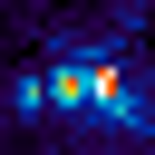</td>
    <td>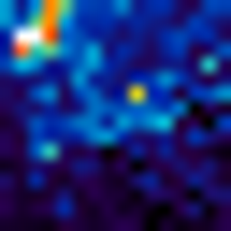</td>
    <td>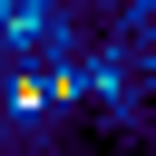</td>
    <td>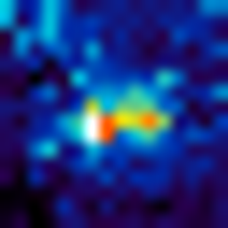</td>
  </tr>
  <tr>
    <td>0.07</td>
    <td></td>
    <td></td>
    <td></td>
    <td></td>
    <td></td>
    <td></td>
    <td></td>
    <td></td>
  </tr>
</table>

## Interpretation

This suggests a pruning-like behavior in the adaptive tokenizer. At low compression, many active latent tokens attend to overlapping input regions. At stronger compression, KARL appears to preserve a smaller set of more spatially distinct attention patterns.

## Artifacts

- [Latent epsilon diversity summary](../results/latent_distinctiveness_v1/tables/latent_epsilon_diversity_summary.csv)
- [Analysis script](../scripts/analyze_karl_latent_diversity.py)
- [Visual example renderer](../scripts/render_direction3_attention_examples.py)
