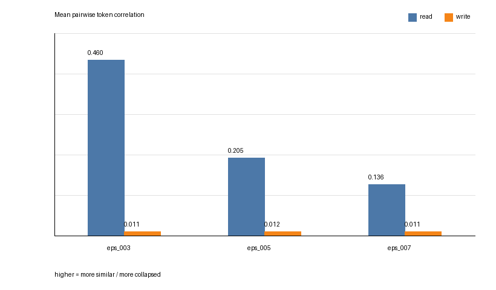
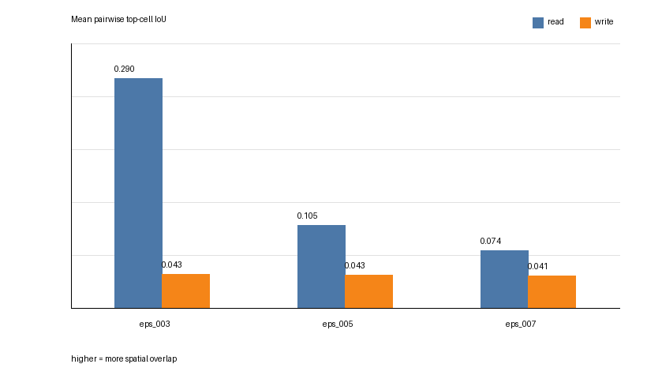

# Direction 3: Compression Keeps More Distinct Latent Readers

This probe asks whether stronger KARL compression makes the remaining active latent tokens collapse onto the same image regions, or whether the surviving tokens become less redundant.

## Metric

For each active latent index `k`, I use the same encoder read map as Direction 1:

```text
read_map(k) = mean_heads Attention(q_latent[k], K_input_grid) in R^{16x16}
```

For each frame and epsilon, active read maps are normalized and compared pairwise. The analysis samples up to 5,000 active-token pairs per frame.

- Pairwise correlation: higher means two latent tokens read from similar spatial patterns.
- Top-cell IoU: overlap between each token's top 16 attended grid cells.
- Center distance: distance between the attention centers of two latent tokens.
- Read distinctness: `1 - pairwise correlation`.

Setup:

```text
60 unique videos
8 uniformly sampled frames per video
480 frame rows per epsilon
eps = 0.03, 0.05, 0.07
```

## Result

| epsilon | mean active tokens | read correlation | top-cell IoU | center distance | read distinctness |
|---|---:|---:|---:|---:|---:|
| 0.03 | 251.25 | 0.4604 | 0.2900 | 1.477 | 0.5396 |
| 0.05 | 198.89 | 0.2052 | 0.1055 | 2.033 | 0.7948 |
| 0.07 | 115.57 | 0.1358 | 0.0737 | 2.414 | 0.8642 |

As epsilon increases, KARL keeps fewer active tokens. But the surviving read maps also become less similar: pairwise correlation drops, top-cell overlap drops, and attention centers move farther apart. The strongest signal is not just that KARL uses fewer tokens, but that the remaining tokens appear less redundant in where they read from.





## Interpretation

This suggests a pruning-like behavior in the adaptive tokenizer. At low compression, many active latent tokens can read from overlapping input regions. At stronger compression, KARL appears to preserve a smaller set of more spatially distinct readers.

The read-side trend is the clearest part of this result. Write maps are already close to decorrelated across epsilons, so this direction focuses on the encoder read maps.

## Artifacts

- [Latent epsilon diversity summary](../results/latent_distinctiveness_v1/tables/latent_epsilon_diversity_summary.csv)
- [Analysis script](../scripts/analyze_karl_latent_diversity.py)
