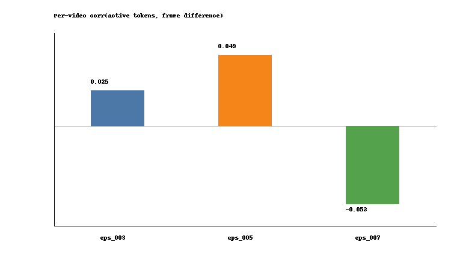

# Direction 4: Temporal Token Usage

This probe asks how KARL's active token count changes across sampled frames from the same video.

## Setup

KARL is still applied frame-by-frame. For each video, I use the same 8 uniformly sampled frames and record how many latent tokens remain active after the halting threshold.

```text
60 unique videos
8 uniformly sampled frames per video
3 epsilon settings: 0.03, 0.05, 0.07
1440 frame-epsilon rows
```

I compare active-token traces against a simple frame-difference signal, computed as RGB L1 difference between neighboring sampled frames. This is only a low-level baseline for visual change, not a semantic motion detector.

## Result

| epsilon | videos | mean active-token std | mean active-token range | zero-range videos | mean corr(active tokens, frame diff) |
|---|---:|---:|---:|---:|---:|
| 0.03 | 60 | 4.29 | 10.98 | 43 | 0.025 |
| 0.05 | 60 | 21.38 | 59.43 | 11 | 0.049 |
| 0.07 | 60 | 20.88 | 57.37 | 6 | -0.053 |

At `eps=0.03`, KARL is near the full 256-token budget for many frames, so temporal variation is often flat. At `eps=0.05` and `eps=0.07`, active-token count varies much more within the same video.


The second plot checks whether that variation is explained by a simple low-level frame-difference metric. The mean correlations are close to zero across epsilons.



## Interpretation

The useful takeaway is that KARL token usage should not be summarized only by one average number per epsilon. Once compression is strong enough, the active-token budget changes substantially across frames within the same video.

The weak average correlation with raw RGB frame difference is also informative: active-token variation is not simply tracking low-level pixel change. Some individual videos show strong positive or negative correlations, but the aggregate result suggests that token allocation is a more complex frame-level behavior.

## Artifacts

- [Temporal token usage summary](../results/temporal_token_usage_v1/tables/temporal_token_usage_summary.csv)
- [Analysis script](../scripts/analyze_karl_temporal_token_usage.py)
